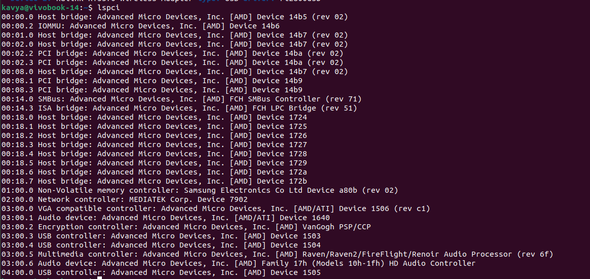

Clearly didn't follow the ambitious statement from the last post. Here's something that I'm writing solely so that I don't forget what I had to do to get things working.

Anyway, I recently upgraded my laptop from a Lenovo Ideapad (i5 core) to an ASUS Vivobook Go 14 (AMD Ryzen 5). Unboxed this beauty of a laptop, and verified that everything worked fine on Windows. Next step? Obviously, chuck Windows and dual-boot a Linux distro!

My dad wasn't too keen on this, and kept nudging me towards using a VM on Windows instead. Love for Linux won, and I said that dual-booting Linux was a piece of cake. Ah, how wrong I was going to be!

I chose to go with Ubuntu 22.04, and dual-booting it was fairly straightforward, until I noticed it didn't recognize the WiFi device.

```
lspci
```


points to the Network controller being MEDIATEK Corp. Device 7902.

A quick Google search led to this [exchange](https://unix.stackexchange.com/questions/763127/mt7902-driver-for-ubuntu). Basically, Linux doesn't have a driver for MediaTek devices. No way around it except to use a WiFi adapter (which I thankfully had).

I thought the hurdles ended here, and blissfully used the laptop for a few more days. One night, I had a call, and hopped onto Google Meet just to find out that the microphone wasn't recognized either. I scrambled to find a solution, and then decided to make do with my mobile phone instead. 

The next day, it was time to figure out this new issue. What could be the issue? Settings -> Sound showed me this:


Great, so my output devices work fine but input does not. Time to move to the terminal:

```
lspci
```

to the rescue again. 

The audio devices and multimedia controllers are all from AMD. Honestly, I should've known this was going to be a problem :P

I tried a bunch of solutions from Stack Exchange, involving pavucontrol and alsa-mixer. But how would these help when the device doesn't seem to have a driver at all? I eventually gave up on these, and went to look for a solution I dreaded - recompiling the kernel directly.

I read somewhere that this issue usually occurs when devices use a digital microphone (DMIC). I went to browse the Linux source code, and found a [file](https://elixir.bootlin.com/linux/v6.9.3/source/sound/soc/amd/yc/acp6x-mach.c) that defines the machine driver for the AMD Yellow Carp platform.

The latest kernel version at the time was 6.9.3, so I decided to use that. One thing that gave me some confidence was that I could spot an entry for E1504FA (Asus Vivobook Go 15) at https://elixir.bootlin.com/linux/v6.9.3/source/sound/soc/amd/yc/acp6x-mach.c, and I assumed I just needed to add an entry for my device (yay, I was right).

I downloaded the source, and edited the file to add an entry for my device E1404FA(ASUS Vivobook Go 14). Recompilation was something I'd done frequently in my 8th semester at college, for a Systems Programming course. Easy-peasy, especially with this [article](https://www.baeldung.com/linux/kernel-recompilation) to make sure I didn't skip steps.

Note: Make sure to back up any important data you have. 
Now for the moment of truth:


Hooray! That's sorted, then. 
I happily went to move all my backed-up data from the hard disk back onto my system - and found out that I can no longer get it to recognize a USB device. 


Interestingly, the WiFi Adapter still works, and no other USB device works with the new kernel version. I was too tired of fiddling with kernel code at this point, so it's still an open issue for me. My current solution is to boot into whichever kernel I need depending on whether I'm joining a call or using a USB. Haven't had to use both simultaneously so far, and I hope it stays that way xD. 

Here's to hoping I can find some time to look into what the issue is with the USB module, and update this article soon with a fix for that as well. Until then, rebooting each time is my only solution for this mess.

All in all, glad to have taken that System Programming course!